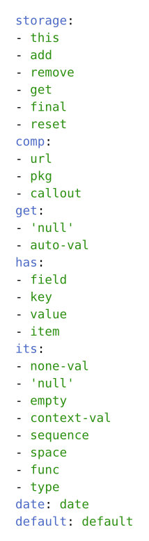

# Developer's Toolbox

<div align="center">

<p class="hidden">
  Easily implement and reuse tools and components across projects.
</p>

<p class="hidden">
  <a href="https://typst.app/universe/package/toolbox">
    </a>
  <a href="https://github.com/mayconfmelo/toolbox/tree/dev/">
    </a>
</p>

[](https://raw.githubusercontent.com/mayconfmelo/toolbox/refs/tags/0.0.1/docs/manual.pdf)
[](https://raw.githubusercontent.com/mayconfmelo/toolbox/refs/tags/0.0.1/docs/example.pdf)
[](https://github.com/mayconfmelo/toolbox/blob/0.0.1/docs/assets/example.typ)
[](https://github.com/mayconfmelo/toolbox/blob/main/docs/changelog.md)
[](https://github.com/mayconfmelo/toolbox/blob/main/docs/contributing.md)


<p class="hidden">
  <a href="https://github.com/mayconfmelo/toolbox/actions/workflows/tests.yml">
    </a>
  <a href="https://github.com/mayconfmelo/toolbox/actions/workflows/build.yml">
    </a>
  <a href="https://github.com/mayconfmelo/toolbox/actions/workflows/spellcheck.yml">
    </a>
</p>
</div>


## Quick Start

```typ
#import "@preview/toolbox:0.0.1": *
```

## Description

Easily implement some frequently used code across multiple projects in a unified
way. This package was created as part of the development of [my other Typst
projects](https://typst.app/universe/search/?q=author%3A%22Maycon%20F.%20Melo%22);
it contains basic code and structures that frequently appear in various projects
and need to be manually rewritten each time — and therefore are rarely identical
and homogeneous, even if they perform exactly the same tasks. It is not intended
to be a full heavy-loaded development toolset, but rather a compartmentalization
of resources shared among my other projects.


## Feature List

- Replacement of Typst defaults by custom defaults
- Databases to store anything
  - Support for compartmentalization through namespaces
  - Add, append, and remove values
  - Retrieve individual values or whole namespace
  - Retrieve final value status
  - Reset namespace
- Visual components
  - Paper-friendly links (attached to footnotes)
  - General package URLs
  - Customizable callout box
- Expands Typst values
  - Generate `#datetime` using positional and/or named arguments
  - Null value
  - Replacement of `auto` values
- Attribute checks for different types
  - Content fields
  - Dictionary keys
  - Dictionary values
  - Array items
- Specific tests
  - `none` values
  - `#get.null` values
  - Empty values
  - `context()` values
  - Content `sequence` values
  - Content `space` values
  - Content functions
  - Value types


### Internal Structure



This is a YAML representation of the package internal structure and all its
features.